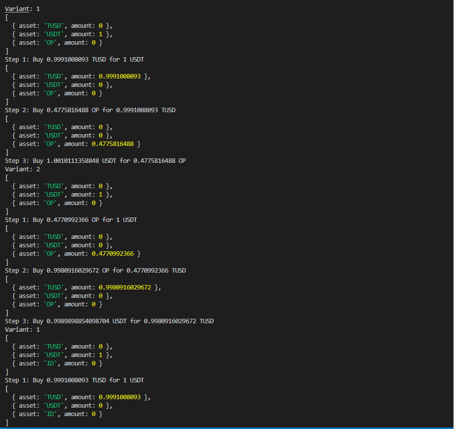
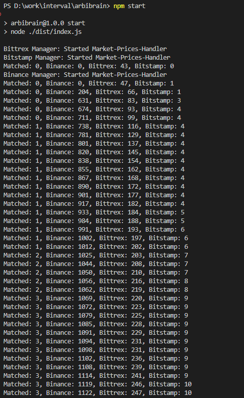

# ArbiBrain: Arbitrage Trading Bot

ArbiBrain is arbitrage trading bot designed to identify and execute profitable trading opportunities across various markets. 

The bot leverages the price discrepancies between different exchanges to capitalize on profit opportunities while minimizing risk.

Node Version: 16.10.0
NPM Version: 7.24.0